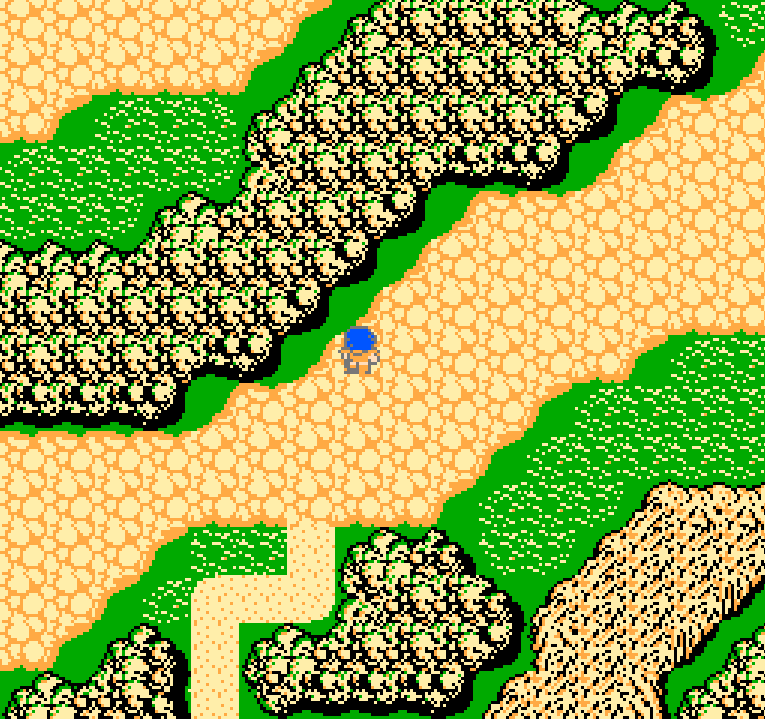
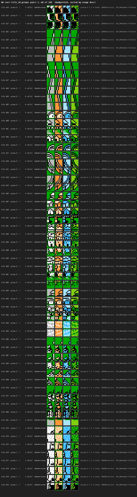

# Phase 2: Neo6502 Attribute-Group Palette

How the overworld went from a flat four-colour compromise to per-tile group colouring on a hardware platform that can't do per-cell palette swaps.



## The problem

The NES overworld uses four separate four-colour **attribute groups**. Every 16×16 metatile picks one of the groups, and inside each group the four colour slots mean different things:

| Group | Slot 2 / 3        | Used for                 |
|-------|-------------------|--------------------------|
| 0     | `$10 / $30`       | Castles, towns (grey / white stone) |
| 1     | `$27 / $37`       | Deserts, bridges, rooftops (orange / peach) |
| 2     | `$31 / $21`       | Ocean, rivers, ice (blue tones) |
| 3     | `$29 / $19`       | Forest, grass, tree crowns (green tones) |

Slots 0 and 1 are shared across all groups (`$0F` black and `$1A` dark green).

The FF1 PPU rendering pipeline just writes the attribute byte into `$23C0..$23FF`; the NES PPU reads it during scanout and samples the right four-colour palette per cell.

The Commander X16 has no trouble with this — VERA's tile-map format has a **per-tile palette offset**, so our existing `ppu_flush` just OR's the group into the tile entry and VERA handles the rest.

The Neo6502 does **not** work that way, and that's what this document is about.

## How the Neo's scanout differs

The Neo6502's DVI output samples a **single global 256-entry palette** for every pixel on every scanline. `GFXDrawImage` paints a tile by writing 4bpp pixel indices into a framebuffer; those indices are looked up against the shared palette at scanout time.

Consequences:

- There is no per-tile or per-cell palette offset. A pixel value of `$02` means the same thing everywhere on screen.
- Reprogramming the palette mid-frame is possible but doesn't help. By the time `HAL_WaitVblank` returns, the whole frame has already been composited with *one* palette.
- A Draw Image call is "dumb" — it writes pixel indices verbatim. If a tile is baked with pixel index `$02` meaning "grass green", that tile can't be re-used for "sand orange" without re-baking it.

In other words: on NES the attribute byte is a runtime input; on Neo it has to be resolved at **bake time**.

## Phase 1: flat four-colour palette

The first Neo overworld render used a single set of four colours (black, dark green, mid grey, white). Every OW tile was baked with those colour slots. It was enough to prove the viewport / camera / metatile decode pipeline was correct, but it looked obviously wrong — everything was grass-green, oceans and deserts included.

See [src/system/neo/palette.asm](../src/system/neo/palette.asm) for the Phase 1 palette layout and the notes that preceded Phase 2.

## Phase 2 options we considered

### Option A — per-cell palette reprogramming

"When the scanout reaches row N, reprogram palette slots 2/3 to the group that row needs."

Rejected. The Neo DVI scanout runs off DMA with no mid-frame hook available to user code. Even if we could time it, a cell is 16 pixels tall and cells in the same row can belong to different groups.

### Option B — decoupled palette, multiple small palettes, load on demand

"Keep one set of tile bakes; load the right four-colour palette for whatever the current player is looking at."

Rejected. Same problem — it's still one palette per frame, and a single frame of the overworld shows all four groups at once (coast, beach, plains, forest are often all on-screen together). This only works on hardware that can per-cell-swap, i.e. the X16.

### Option C — use all 16 colours flat

"Compose one 16-entry palette that has all four groups' colours; use the composer to pick a compromise."

This was what I thought we had already — the composer output showed the OW using only a handful of slots. A screenshot inspection (four background colours plus three sprite colours, seven distinct colours total) confirmed it: the composer was collapsing groups 0/1/2/3 into one compromise set because it didn't know which NES attribute groups were logically distinct.

Not actually rejected — this is effectively what Phase 1 was. The point is that flat-palette mode tops out around 7 visibly-different colours on screen, and that's not enough to distinguish sand, stone, water, and grass.

### Option D — bake per-(tile, group) variants

"For every pair (tile_id, group) that the OW actually uses, bake a separate 16×16 Neo tile with that group's colours pre-applied. Translate `(tile_id, group) → Neo slot` at `ppu_flush` time."

Accepted. This moves the attribute decision from runtime to build time, which is exactly what the Neo hardware wants.

The catch: `GFXDrawImage` only has 128 slots for 16×16 tile images (`$00..$7F`). A full enumeration of `tile_id × group` is 256 × 4 = 1024 pairs, way over budget.

## Histogram analysis

Before committing to Option D I ran a full-map histogram over `map_ow.rle`. The results:

- **236 unique `(tile_id, group)` pairs** actually appear anywhere on the overworld.
- **128 of those** already cover **99.9%** of cells.
- The long tail (108 rare pairs) accounts for ~0.1% of cells — largely edge-cases like a single bridge tile in an unusual group, or UI-ish tiles that snuck into the OW data.

So the budget fits if we take the 128 most frequent variants and find *something* sensible for the remaining 108.

## Picking fallbacks for the rare tail

For the 108 rare pairs I generated contact sheets so a human could eyeball the options. Each rare pair was rendered twice — once with its "wanted" group, once with each group we had already baked a variant for:

- [rare_pairs_sheet_01.png](images/rare_pairs_sheet_01.png) — rare pairs, full colour, in the group they *should* use
- [rare_pairs_sheet_02.png](images/rare_pairs_sheet_02.png) — more of the above
- [rare_fallback_sheet_01.png](images/rare_fallback_sheet_01.png) — fallback candidates: each rare pair shown against the groups it *could* borrow from
- [rare_fallback_sheet_02.png](images/rare_fallback_sheet_02.png) — more of the above



The fallback logic compares the average luminance of the "wanted" group's colours (slots 2 and 3) to every *available* baked group for the same `tile_id`, and picks the one with the closest luminance. Borrow a neighbour's shades before you borrow a neighbour's hues — a sand tile falling back to its grey-stone baked variant looks less jarring than falling back to its ocean-blue one.

The final picks ended up in [rare_fallback_picks.csv](images/rare_fallback_picks.csv). Many entries in that CSV actually show `baked_groups=[]` and `auto_pick=None` — those are tiles where *no* group got baked at all; they route to slot 0 (the single most-used OW tile) at runtime. 107 tiles, 252 cells, 0.096% of the map.

## Final bake strategy

The first naive version ranked all 236 pairs by cell-count and kept the top 128. That broke the render badly: popular tiles (ocean water, plains grass) would eat 3–4 slots each because they appear in multiple groups, and 108 tile_ids ended up with **zero** baked variants — blank cells everywhere.

The correction (the version in the shipped build):

1. **Step 1: one slot per distinct `tile_id`.** Rank tile_ids by total frequency, take the top 128, and for each one pick the group it uses *most often* as its baked variant. This guarantees that the 128 most-used tile_ids render with a plausible palette and gives us a luminance-matched fallback for every rare-group case on those tiles.
2. **Step 2: fill any leftover budget.** After step 1 the budget is usually already full, but if tile_id/group coverage left gaps, the most-popular additional `(tile_id, group)` pairs fill them.
3. **Runtime LUT.** At build time emit a 1 KB table keyed `tile_id * 4 + group` with the Neo slot to draw. Rare pairs resolve to the same-tile nearest-luminance variant; orphaned tile_ids resolve to slot 0.

Implementation: [scripts/chr_to_neo_gfx.py](../scripts/chr_to_neo_gfx.py) `--mode map-groups`, which emits both `tiles_ow.gfx` and a sibling `tiles_ow_groups.lut`.

## Runtime wiring

The LUT is exposed to the assembler via [src/system/neo/tile_group_lut.asm](../src/system/neo/tile_group_lut.asm) using `.incbin`.

[src/system/neo/ppu_flush.asm](../src/system/neo/ppu_flush.asm) consumes it in the map-mode cell-draw path. Pseudocode:

```
for each visible 8×8 cell:
    tile_id = nt_mirror[row][col]
    group   = attr_mirror[row][col]          ; 2 bits, 0..3
    slot    = neo_tile_group_lut[tile_id * 4 + group]
    GFXDrawImage(slot, x, y)
```

The LUT index can hit 1023 so `ppu_flush` uses a 16-bit pointer: the high byte of the base is computed as `>(neo_tile_group_lut) + (tile_id >> 6)` so the subsequent Y-indexed load stays within 256 bytes of the pointer's low byte.

## How we debugged the all-green render

Before arriving at Option D, a lot of time went into debugging why the Neo OW looked like one big patch of grass even though the X16 looked correct.

1. **Per-cell swap hypothesis.** Hypothesised the Neo must somehow support per-cell palette offsets like VERA does. A firmware deep-dive confirmed it doesn't: `GFXDrawImage` is a framebuffer blit and sampling happens against the global LUT at scanout.
2. **"Palette playground" shim.** Added a `HAL_TestPaletteSwap` entry point that cycled through six candidate OW palettes, one per half-second, so we could eyeball which combination of four colours gave the best compromise. Output was always disappointing because *no* four-colour set works for stone + sand + water + grass.
3. **Actual on-screen colour count.** A Python inspection of a clean OW screenshot found exactly seven distinct colours (four BG + three sprite). Confirmed the on-hardware palette was behaving — the composer, not the hardware, was the four-colour bottleneck.
4. **Histogram.** Once we knew it had to be a bake-time solution, the histogram told us the budget was in reach.

The playground shim (`HAL_TestPaletteSwap`, `test_pal_rgb`, `pal_test_base`, etc.) has since been removed from [src/system/neo/palette.asm](../src/system/neo/palette.asm) and [src/app/map_test_shim.asm](../src/app/map_test_shim.asm).

## Results

- **128** distinct `(tile_id, group)` variants baked.
- **107** tile_ids dropped entirely → 252 cells (0.096% of the OW) render as slot-0 filler.
- **99.722%** of cells get their exact-wanted variant.
- **0.278%** of cells get a same-tile nearest-luminance fallback.
- Overworld renders with visually-distinct stone / sand / water / grass groups at full Neo frame rate.

Final render, for the record:


## Known limits and follow-ups

- The 107 dropped tile_ids are all very rare, but if any of them show up inside the 16×15 window it'll look like a glitched cell. The fix is either raising the bake budget (Neo firmware allows 128 × 16×16 + 64 × 32×32, not all used), or falling back to a nearest-luminance variant across a *different* tile_id instead of slot 0.
- The approach is specific to the overworld's palette structure (four groups, two shared slots). Town/dungeon maps use the same PPU attribute model and should reuse this path with a per-map bake.
- On X16 this entire document is academic — VERA per-tile palette offset means a single set of 128 baked tiles plus an attribute-to-offset mapping handles every group.
